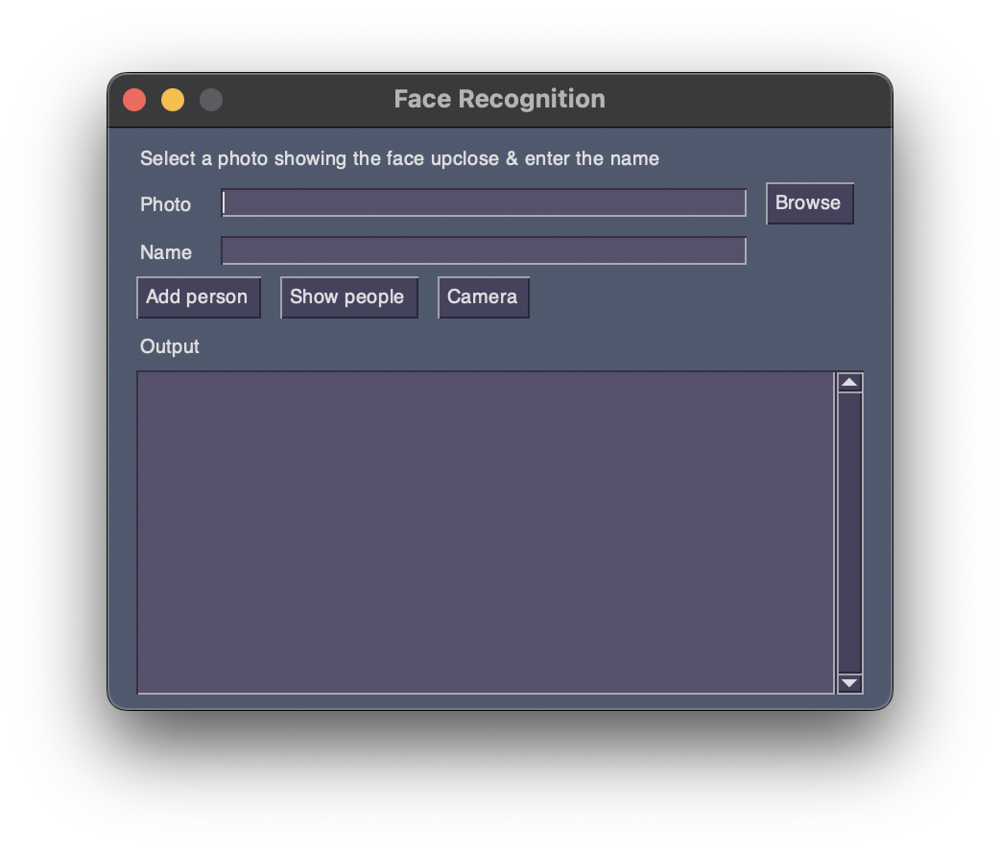

## Face Recognition

Face recognition program to recognise faces from webcam in real time. Program was developed as a university project. It includes an interface which allows the user to add more faces. Facial recognition is achieved  thorugh face-recognition module and the code for face recognition is based from the [face_recognition](https://github.com/ageitgey/face_recognition/blob/master/examples/facerec_from_webcam.py) github repository.

## Tested on:

#### Device: Macbook Pro

#### Processor: M1

#### System: macOs Ventura 13.0

 
### Setup:

Brew and Python3 need to be installed

1. Intstall OpenCV  `pip3 install opencv-contrib-python`

2. Type python3 at command prompt to get angled brackets. Then type `import cv2` after type `cv2.__version__` a version number should be returned

3. Installing dlib and face_recognition
   
   1. `pip3 install pillow`
   
   2. `pip3 install imutils`
   
   3. `brew install cmake`
   
   4. `brew install dlib` or `pip3 install dlib`
   
   5. `pip3 install face_recognition`

 

#### Watch youtube video from LearnEDU for a more detailed intallation [Link](https://www.youtube.com/watch?v=70L3By4pci0)

#### Setup instructions taken from youtube video.
